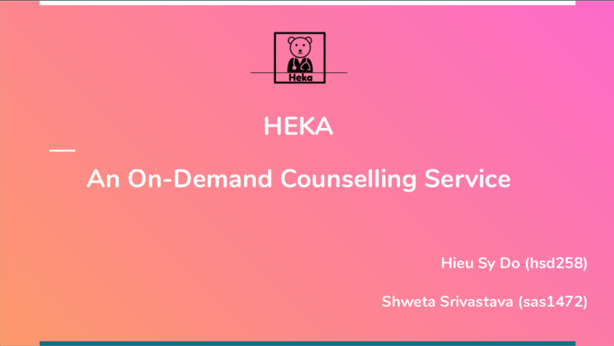

# On-Demand Counseling Service

NYU Cloud Project - Spring 2019

## Problem

- Finding available health services can be an exhausting process, especially when it comes to therapy appointments.
- We believe that it should not take such a long time to get connected with a physician.

## Solution: Heka

- We want to build an end-to-end Lex counselling application that helps mitigate the long waiting issue with psychiatry appointments.
- Users of our app are college students and counselors.
- The bot will act like the primary caregiver and try to achieve the following goals:
  - Ask leading questions to help the user describe the problem
  - Categorize the issue according to some specified categories
  - Provide some simple resources to help the patient
- Upon patient request, the bot can connect the patient to an available counselor.

## Demo Video

## Credits
Free Adminpro theme by ColorLib